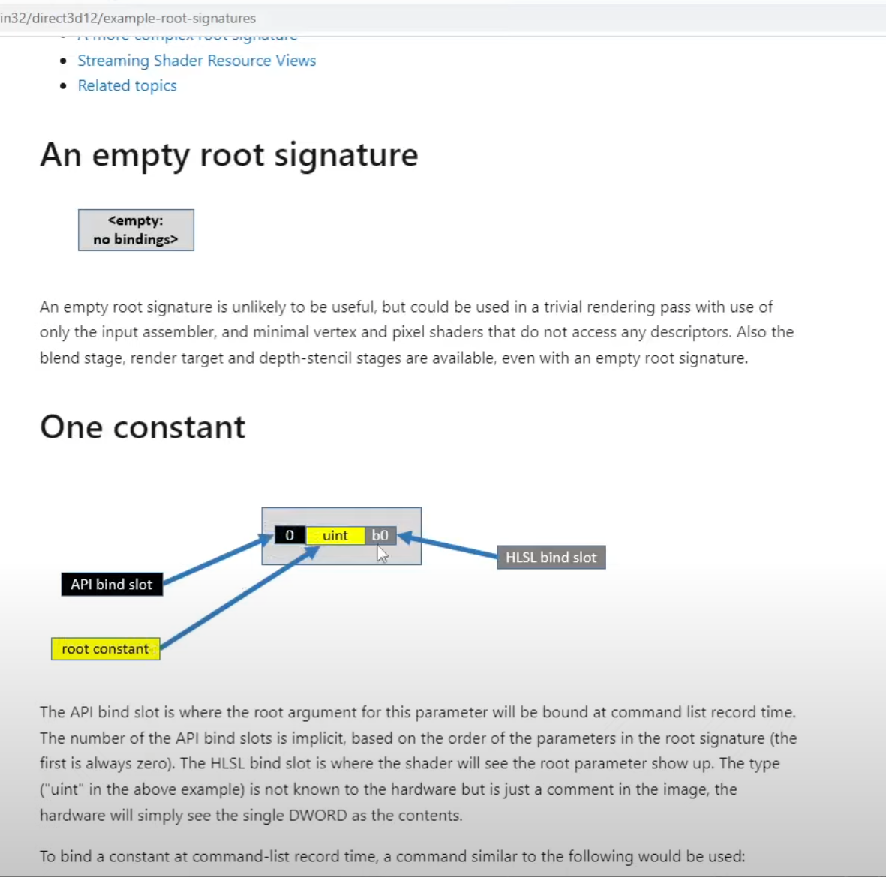

# PSO

> [The D3D12 Pipeline State Object](https://logins.github.io/graphics/2020/04/12/DX12PipelineStateObject.html)


# Root signature

> [example-root-signatures](https://learn.microsoft.com/en-us/windows/win32/direct3d12/example-root-signatures)




# Pipeline State Object

PSO(Pipeline State Object)是Direct3D 12中重要的概念。它封装了渲染管线中的多个状态，包括:
- 顶点着色器和像素着色器
- 栅格化状态(多样本抗锯齿、缓存模式等)
- 深度和采样状态
- 输入布局和输出布局
- 根签名 
  - (描述每個可編程階段可用的資源集（例如紋理）)

简而言之，PSO代表了一个完整的渲染管线状态。开发者可以创建多个PSO，对应不同的渲染效果。这允许高效地切换渲染状态。
通过D3D12 API，开发者可以:
- 创建PSO(ID3D12Device::CreateGraphicsPipelineState())
- 设置PSO(ID3D12GraphicsCommandList::SetPipelineState())
- 删除PSO(ID3D12Device::DestroyPipelineState())

# 參考代碼

```C++
// 顶点着色器和像素着色器
auto vsBlob = ...; 
auto psBlob = ...;

// 输入布局
D3D12_INPUT_ELEMENT_DESC inputLayout[] = { ... };

// 创建管线状态对象描述
D3D12_GRAPHICS_PIPELINE_STATE_DESC psoDesc = {};
psoDesc.VS = { ... };   // 顶点着色器
psoDesc.PS = { ... };   // 像素着色器
psoDesc.InputLayout = { ... }; // 输入布局
psoDesc.RasterizerState = ...; // 栅格状态
...

// 创建管线状态对象  
ID3D12PipelineState* pso;
dev->CreateGraphicsPipelineState(&psoDesc, IID_PPV_ARGS(&pso));

// 在命令列表中使用管线状态对象
cmdList->SetPipelineState(pso);

...

// 最后释放管线状态对象
pso->Release();
```

```c++
struct PipelineStateStream
{
    CD3DX12_PIPELINE_STATE_STREAM_ROOT_SIGNATURE RootSignature;
    CD3DX12_PIPELINE_STATE_STREAM_INPUT_LAYOUT InputLayout;
    CD3DX12_PIPELINE_STATE_STREAM_PRIMITIVE_TOPOLOGY PrimitiveTopologyType;
    CD3DX12_PIPELINE_STATE_STREAM_VS VS;
    CD3DX12_PIPELINE_STATE_STREAM_PS PS;
    CD3DX12_PIPELINE_STATE_STREAM_RENDER_TARGET_FORMATS RTVFormats;
} pipelineStateStream;
```